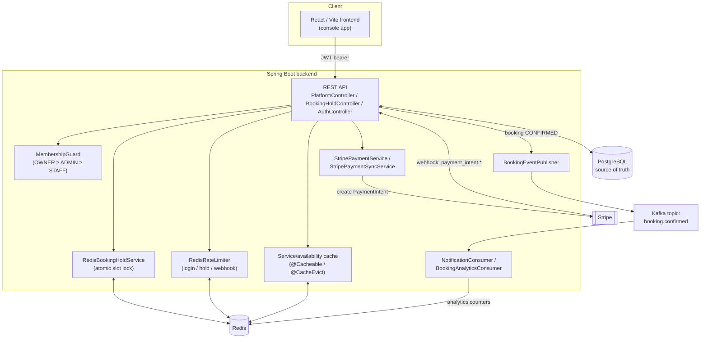

# Multi-Tenant Booking Platform

[](https://github.com/kiky97/Multi-Tenant-Booking-Platform/actions/workflows/ci.yml)

A multi-tenant SaaS booking platform (think: the infrastructure behind Calendly/Fresha-style
products) built to explore how far a booking engine's hardest problem — **never double-booking a
slot** — can be pushed with Redis, and how that same system scales into a real multi-tenant
product with RBAC, Stripe payments, and async event fan-out.

Backend: Spring Boot 4 (Java 21) · Frontend: React 18 + Vite · Postgres · Redis · Kafka

## Live demo

- App: _add your Render URL here after deploying — see [DEPLOYMENT.md](DEPLOYMENT.md)_
- Health check: `GET /actuator/health`

## Why this exists

Most CRUD booking demos skip the one thing that actually makes booking systems hard: two people
clicking "book" on the same slot at the same millisecond. This project treats that as the central
problem and builds outward from it — first a single-tenant booking engine with a Redis-backed
slot lock, then a full multi-tenant platform (organizations, roles, payments, async analytics)
around it.

## Architecture



## The core design decisions

### Why Redis for double-booking prevention, not a DB constraint

A `UNIQUE` constraint on `(staff_id, start_time)` only stops two *committed* bookings from
colliding — it does nothing for the seconds between "customer picked a slot" and "payment
finished," which is exactly the window where two customers can both see a slot as free. That gap
needs a **lock that expires on its own** if the customer abandons checkout, which a DB row can't
give you cheaply.

[`RedisBookingHoldService`](backend/src/main/java/com/booking/engine/platform/service/RedisBookingHoldService.java)
uses a `SETNX`-style atomic set (`setIfAbsent`) keyed by `organizationId:staffId:startTime`, with
a short TTL (default 5 minutes). Two concurrent hold requests for the same slot race on that one
Redis write — only one wins, atomically, with no application-level locking or DB round trip
needed to decide. `createBooking` then does a second, defense-in-depth overlap check against
Postgres (`existsByStaffIdAndStatusInAndStartTimeLessThanAndEndTimeGreaterThan`) for anything that
slipped past the hold — e.g. a hold that outlived its own TTL under a very slow request.

Same primitive (`INCR` + `EXPIRE`, fixed window) powers
[`RedisRateLimiter`](backend/src/main/java/com/booking/engine/platform/service/RedisRateLimiter.java)
for login attempts, public hold requests, and invalid Stripe webhook signatures — anywhere a
client could hammer an endpoint cheaper than the system can process it.

### Why Kafka for analytics, not just writing to the DB in-request

When a Stripe webhook confirms a booking, the request handling it (`StripeController` →
`StripePaymentSyncService`) has one job: update that one booking's status, correctly and quickly,
so Stripe doesn't retry the webhook needlessly. Bolting "also recompute the organization's
analytics counters" onto that same request couples a fast, latency-sensitive write to a slower,
unrelated read-side concern — and if the analytics update fails, should the payment confirmation
roll back? It shouldn't.

[`BookingEventPublisher`](backend/src/main/java/com/booking/engine/platform/kafka/BookingEventPublisher.java)
instead emits a `booking.confirmed` event and returns immediately. Two independent consumer
groups subscribe to the same topic —
[`BookingAnalyticsConsumer`](backend/src/main/java/com/booking/engine/platform/kafka/BookingAnalyticsConsumer.java)
and `NotificationConsumer` — each processing the event at its own pace, in its own failure domain.
A slow or crashed analytics consumer never blocks a payment confirmation, and adding a third
downstream consumer (e.g. a real email/SMS sender) later means subscribing to the same topic, not
touching the webhook handler at all.

(Spring Boot 4.0.7 ships with **no** Kafka autoconfiguration module — unlike Redis/JPA, which each
got their own `spring-boot-*-autoconfigure` module in the 4.x split, Kafka got none. The
`@EnableKafka` + manual `ConsumerFactory`/`ProducerFactory` beans in
[`platform/config`](backend/src/main/java/com/booking/engine/platform/config) exist because
without them, `@KafkaListener` methods are silently never wired to a container — no error, they
just never run.)

### Why the payment flow never trusts the client

`createBooking` creates a Stripe `PaymentIntent` and returns its `client_secret` to the frontend,
but the booking is saved with `status=HELD`, not `CONFIRMED`. Only
[`StripePaymentSyncService.handlePaymentIntentEvent`](backend/src/main/java/com/booking/engine/platform/service/StripePaymentSyncService.java),
driven exclusively by Stripe's signed webhook, is allowed to move a booking to `CONFIRMED`. A
compromised or buggy frontend claiming "payment succeeded" can't confirm a booking — only Stripe's
own signature-verified callback can.

### Why RBAC is membership-based, not a single role on the user

A user's role is meaningless without an organization: someone can be `OWNER` of one salon and have
no access at all to another. [`Membership`](backend/src/main/java/com/booking/engine/entity/Membership.java)
rows (user × organization × role) are the actual authorization unit, checked per-request by
[`MembershipGuard`](backend/src/main/java/com/booking/engine/platform/security/MembershipGuard.java)
against the `:organizationId` path variable — `OWNER > ADMIN > STAFF`, enforced as a minimum
threshold per endpoint (e.g. creating a service needs `ADMIN`+, viewing analytics needs `OWNER`).
JWT authentication only proves *who* the caller is; membership decides *what* they can touch.

## Local development

```bash
docker compose up -d      # postgres, redis, kafka, backend
npm run dev --prefix frontend
```

Backend: http://localhost:8080/api/v1 · Frontend: http://localhost:5173 ·
Health: http://localhost:8080/actuator/health

See [`.env.example`](.env.example) for the variables `docker-compose.yml` expects.

## Deploying a live version

See [DEPLOYMENT.md](DEPLOYMENT.md) — Render (backend + frontend) with an external free Postgres
(Neon/Supabase) and Redis (Upstash).

## What's not in the live demo

- **Kafka** is proven working in the local Docker stack (two independent consumer groups
  correctly fanning out `booking.confirmed`), but isn't wired into the free-tier deployment —
  hosted Kafka free tiers need SASL auth this project's producer/consumer config doesn't set up
  yet. The producer/consumer beans still start without one; they just never deliver.
- **Stripe** runs against test-mode keys; no real charges are possible.

## CI/CD

[`.github/workflows/ci.yml`](.github/workflows/ci.yml): every push/PR runs backend tests (pure
Mockito unit tests — no Testcontainers/real DB needed), an OWASP dependency scan, and frontend
lint/test/build. On a push to `main`, it also builds the backend image, pushes it to
`ghcr.io/<repo>/backend`, and pings the Render deploy hook (once configured — see
[DEPLOYMENT.md](DEPLOYMENT.md)). The frontend redeploys on push automatically via Render's own
GitHub integration.

## Tech stack

| | |
|---|---|
| Backend | Spring Boot 4, Spring Data JPA, Spring Security (JWT), Spring Kafka, Flyway |
| Frontend | React 18, Vite, TypeScript (console app), React Query, React Hook Form + Zod |
| Data | PostgreSQL, Redis |
| Messaging | Kafka (KRaft mode, no ZooKeeper) |
| Payments | Stripe (PaymentIntents + signed webhooks) |
| Infra | Docker Compose (local), GitHub Actions (CI/CD), Render (hosting) |
